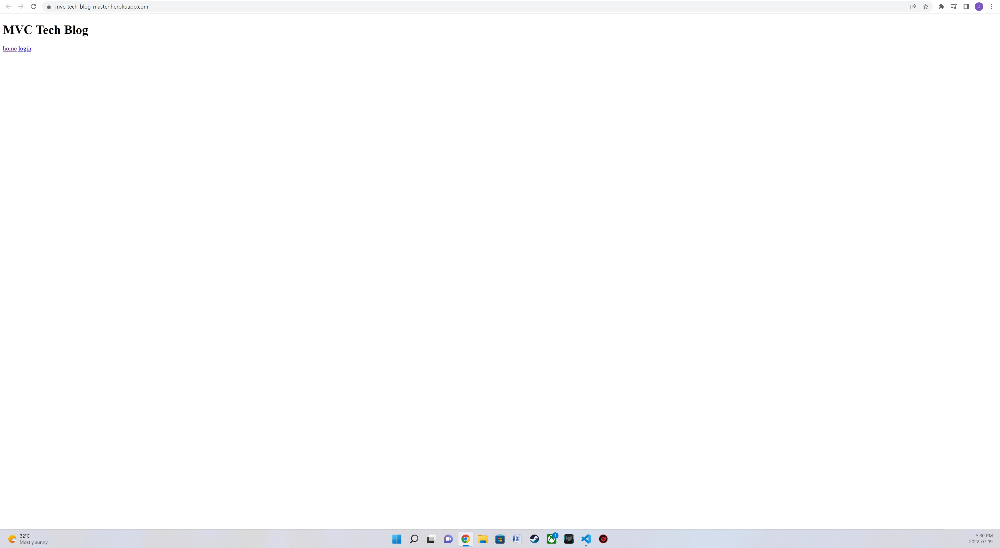

# Tech Blog

### Model-View-Controller (MVC) Challenge 14: Tech Blog

## Project Description
A blog style site where developers can publish, post and comment on other developers posts

## Installation
You can clone the project from GitHub by copying either HTTPS or SSH link or by downloading the project as a zip file. Run npm start to connect and go to localhost:3001 in your browser

## Usage
To run you can visit the deployed website here: https://mvc-tech-blog-master.herokuapp.com/

## Deployed Website
https://mvc-tech-blog-master.herokuapp.com/

## Screenshot
![Screenshot]

  

## Contribution
Made by Joe Chaaya